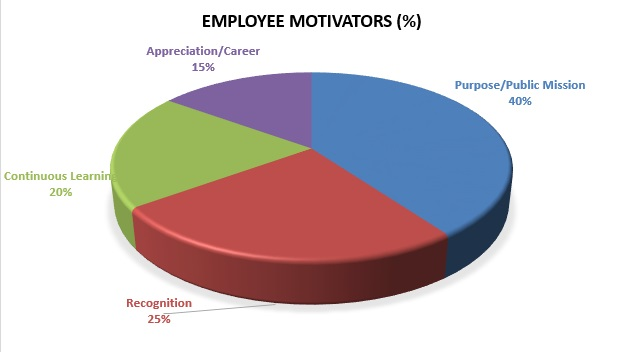
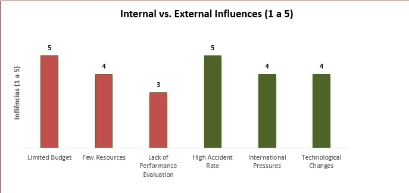
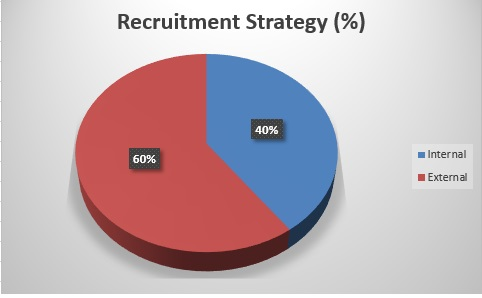
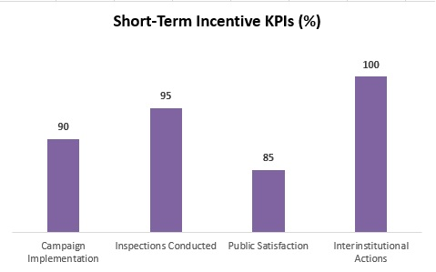
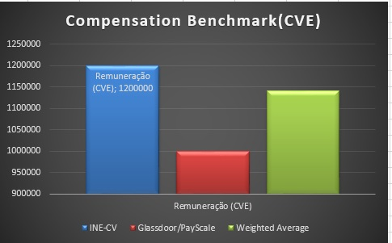
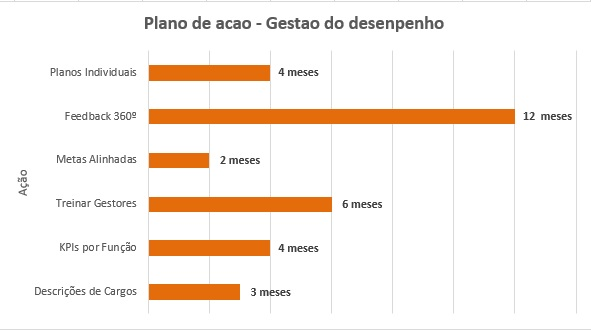

# 📊 Capstone Project – HRM
**Título do Projeto:**  
Alinhamento Estratégico de RH em Contextos Públicos: O Caso da Segurança Rodoviária na DGTR  

---

## Descrição do Projeto
Este repositório apresenta o projeto de **Capstone em Gestão de Recursos Humanos (HRM)**, com foco no alinhamento estratégico em contextos públicos, tomando como caso de estudo a **Direção-Geral de Trânsito e Segurança Rodoviária (DGTR)**.

O projeto inclui:
- 📂 Contexto organizacional  
- 🎯 Estratégias de recrutamento e seleção  
- 📈 Gestão de desempenho  
- 💰 Políticas de remuneração e incentivos  
- 📊 Análises gráficas  

---

## 📈 Análises Gráficas em Destaque
### 1. Motivadores dos Funcionários

### 2. Influências Internas vs Externas

### 3. Estratégia de Recrutamento

### 4. KPIs de Incentivos de Curto Prazo
)

### 5. Benchmark de Remuneração

### 6. Plano de Ação – Gestão de Desempenho

➡️ Mais detalhes em [📂 Pasta `analyses/`](analyses/README.md)

---

## Conclusão e Insights
- A DGTR possui **forte motivação intrínseca** na sua equipa, mas precisa de políticas formais de RH.  
- O **alinhamento estratégico** está em progresso, mas incompleto.  
- Os maiores desafios estão em: **falta de técnicos especializados**, **gestão de desempenho**, **sistemas de incentivos**.  
- Recomenda-se consolidar práticas de **avaliação, carreira e valorização** para transformar o compromisso dos funcionários em **engajamento sustentável**.  

---

## Autora
**Ileida dos Reis**  
Mestre em Gestão de Recursos Humanos | Especialista em Prevenção e Segurança Rodoviária  
