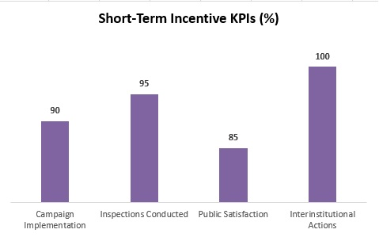
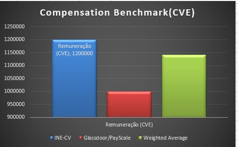

# 📊 Graphical Analysis of the Capstone Project – HRM

This folder contains the main **graphs** that support the analysis of the project  
**“Strategic Alignment of HR in Public Contexts: The Case of Road Safety at the DGTR”**.  

Each graph visually translates the key points of the study.

---

## 1. Employee Motivators
**Description:**  
Shows the percentage distribution of the team's main motivators (purpose, recognition, learning, and appreciation).  

---

## 2. Internal vs. External Influences
**Description:**  
Comparison of internal pressures (e.g., budget, lack of resources, performance evaluation) and external pressures (e.g., accident rates, international organizations, technology).  

---

## 3. Recruitment Strategy
**Description:**  
Shows the percentage split between internal and external recruitment (hybrid strategy).  

---

## 4. Short-Term Incentive KPIs
**Description:**  
Represents performance indicators (campaign execution, inspections, public satisfaction, interinstitutional actions) and their targets.  

---

## 5. Compensation Benchmark
**Description:**  
Compares the average salaries for the position analyzed in three sources: INE-CV, Glassdoor/PayScale, and Weighted Average.  

---

## 6. Action Plan – Performance Management
**Description:**  
Shows the deadlines (in months) for implementing actions such as updating job descriptions, defining KPIs, training managers, aligning goals, 360º feedback, and individual plans.  

---

## Author
**Ileida dos Reis**  
Master's Degree in Human Resources Management | Specialist in Road Safety and Prevention  

---
